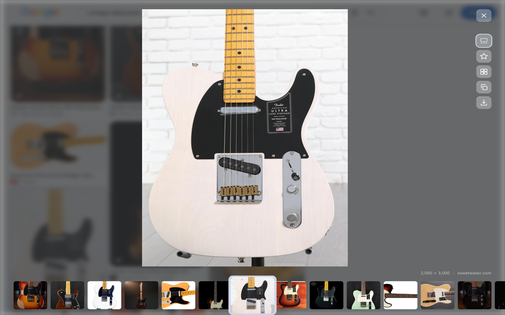
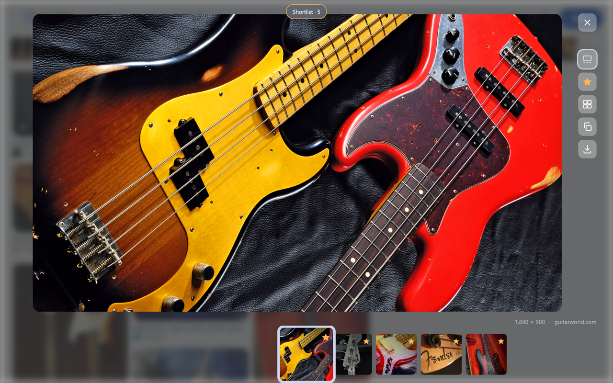
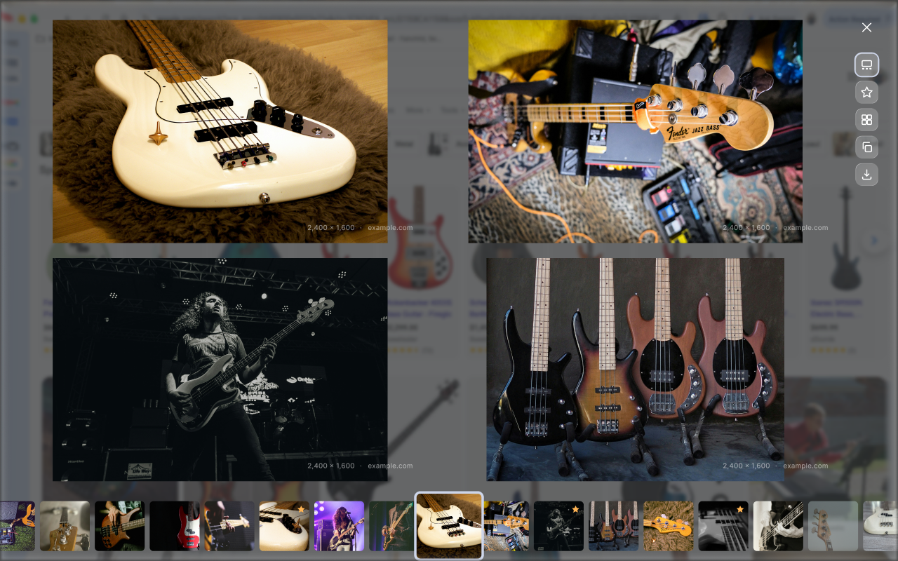

<p align="center">
  
</p>

<h1 align="center">Monocle</h1>

<p align="center"><strong>A fullscreen viewer for Google Images.</strong><br>
One large image at a time, with filmstrip navigation, a shortlist, and side-by-side compare.</p>

<p align="center">
  
  
  
</p>



## Why I built it

Google Images shows you a wall of thumbnails. When I'm searching for reference, I want to actually look at each image: big, uncropped, and without bouncing out to whatever site is hosting it. Monocle turns the results page into a proper viewer.

Click any result and it opens fullscreen at full resolution, growing out of the thumbnail you clicked. A filmstrip along the bottom moves through everything the search found, and you never land on a host site unless you choose to.

## Features

- **Fullscreen viewing.** Every image is scaled to fit, never cropped or stretched, and loaded from the original source rather than Google's proxy.
- **Filmstrip navigation.** The active image stays centered as you move. Hold an arrow key to accelerate.
- **Shortlist.** Star the keepers, then filter the filmstrip down to just those.
- **Compare.** View four starred images at once in a 2×2 grid.
- **Resolution and source.** Always visible, and the domain links to the page.
- **Copy and download.** One key each, straight from the viewer.
- **Zoom and pan.** Scroll to zoom; Cmd/Ctrl-scroll or Shift-scroll to pan.

| Shortlist | Compare |
| --- | --- |
|  |  |

## Keyboard

| Key | Action |
| --- | --- |
| `←` `→` | Previous / next (hold to accelerate) |
| `Space` | Star the current image |
| `S` | Show only starred |
| `G` | Compare starred images |
| `C` / `D` | Copy / download |
| `F` | Hide the filmstrip |
| `Esc` | Step back, then close |

## Privacy

No accounts, no analytics, no tracking. Nothing you view or search is recorded or sent anywhere; Monocle runs entirely in your browser.

It only runs on Google search pages by default. Broader site access is an optional permission, requested from the settings page only if you turn on "copy the image itself" (otherwise Copy puts the image URL on your clipboard). The full reasoning behind each permission is in [`store-assets/LISTING.md`](store-assets/LISTING.md).

## Install from source

1. Clone or download this repo.
2. Open `chrome://extensions` and turn on **Developer mode**.
3. Click **Load unpacked** and select the repo folder.
4. Run a Google Images search and click any result.

## Design process

I designed Monocle iteratively, and the [`design-history`](design-history) folder keeps a snapshot of each stage, from the first AI-generated draft through my own edits, a global recolor, a simplified icon set, and the zoom/pan and fullscreen work:

| Version | Focus |
| --- | --- |
| v1 | Initial AI draft |
| v2 | My edit and extrapolation of the concept |
| v3 | Global recolor and icon direction |
| v4 | Simplified icon set |
| v6 | Zoom/pan fix and fullscreen mode |

## Built with

Plain JavaScript and CSS on Chrome's Manifest V3, with no frameworks and no build step. I built it with Claude as a coding collaborator, which is why it's listed as a co-author on the commits.

## Structure

```
manifest.json         Extension manifest (MV3)
src/
  content.js          Entry point on Google search pages
  google-scraper.js   Reads results and resolves full-resolution sources
  overlay.js/.css     The fullscreen viewer, filmstrip, shortlist, and compare
  background.js       Service worker (downloads, optional permissions)
  options.*           Settings page
icons/                Extension icons
store-assets/         Chrome Web Store listing, screenshots, privacy text
design-history/       Snapshots of each design iteration
```

---

Made by [Sean Fairchild](https://seanfairchild.com) · Combinator Media
